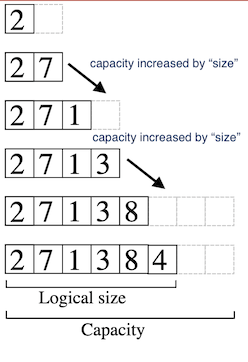

## CSCI 114 Lab 3: List Implementation

For this lab you will implement the List ADT using two different methods: dynamic array backed and linked list using C++ templated classes.

### List ADT

The List ADT stores an ordered collection of like items accessed by index. Our implementation will support the following operations:

```
List.at(index) 				//return the value at index
List.append(value) 			//append the value to the end of the list
List.insert(index,value)	//insert the value at index, shifting items if needed
List.remove(index)			//remove the item at index
List.find(value)			//return the index if the item is in the list, -1 if not
List.size()					//return the size of the list
List.empty()				//return true if size == 0
```

### Dynamic Array Backed List



This implementation of the list will use a dynamically allocated array to store the list contents. If the array has space available (i.e `size < capacity`), then the methods are fairly straight forward to implement. Though, `.insert()` and `.remove()` will need to shift items. If you recieve an out-of-bounds index, throw `std::range_error`. 


If the array is full (i.e `size == capacity`, then a new array needs to be allocated on the heap (using `new`). A new array with twice the size is allocated and the contents of the old array copied over. 

We will use inheritance to derive the class from the List interface.

The C++ List interface:

```
template <typename T>
class List {
public:
	virtual void append(T v)=0;
	virtual void insert(size_t idx, T v)=0;
	virtual T at(size_t idx)=0;
	virtual void remove(size_t idx)=0;
	virtual size_t find(T v)=0;
	virtual size_t size()=0;
	virtual bool empty()=0;
};
```

The Dynamic Array class definition:

```
template <typename T>
class ArrayList : List<T> {
public:
	ArrayList();
	void append(T v);
	void insert(size_t idx, T v);
	T at(size_t idx);
	void remove(size_t idx);
	size_t find(T v);
	size_t size();
	bool empty();

private:
	void resize(); //double the size of the array and copy the items
	size_t capacity;
	size_t size;
	T* data;
};
```
#### Your Task

Implement the member functions in the skeleton code. Use the test code given (or add your own) to test your list.

