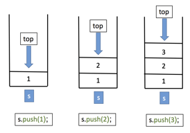
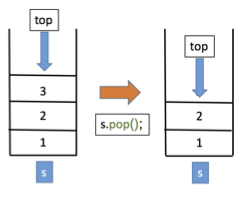

## CSCI 114 Lab 5 Stacks and Heaps

This lab will give us some practice using STL stacks and heaps. We'll revist queues when we learn about graphs and graph search.

### Part 1 Stacks





The stack is a sequence or list-like data structure that only allows `push()` and `pop()` operations on one end. In C++ we can use the STL `<stack>` header to bring in a templated stack data structure:

```
#include <stack>

using namespace std;

int main(int argc, char* argv[])
{
    stack<int> mystack;
    
    mystack.push(1);
    mystack.push(2);
    
    int t = mystack.top();
    cout << t << endl;
    mystack.pop();
    t = mystack.top();
    cout << t << endl;
    
```
Stacks are useful for several interestring algorithms. One simple algorithm is to reverse a sequence by pushing all of the items onto a stack and then popping all of the items off the stack.

#### Your Task Part 1a

Write a C++ program that reads in integers from the user until the user hits `ctrl-d`. The integers should be put into a vector. Print out the vector in-order, then use a STL stack to reverse the sequence and print it out in reverse order.

#### Matching parenthesis/brackets

Stacks can also be used as part of the compiling process to check to see if expressions have correct syntax. We can build a very simple version of this by checking to see if a sequence of open close parenthesis and/or brackets are nested correctly. For example `({<>[()]})` is correct, while `({<>[()}])` is not.

We use the stack in the following way:

* Scan the string from left to right
* When you see an opening bracket, push it onto a stack
* If you see a closing bracket, check to see if it matches the bracket at the top of the stack.
* If it does, `pop()` the top of the stack.
* If it doesn't, then there is a mismatch in the open/close sequence
* When you get to the end of the string, the stack should be empty.
* If the stack is not empty, then there is a mis-match

#### Your Task Part 1b

Write a C++ program that prompts the user for a string containing only open/close parens/brackets from the set `(), {}, [], <>` and whitespace. Read in the string from the user.

Scan the string from left-to-right. Skip any whitespace (you'll need to do this manually since we're scanning ourselves). If you encounter any characters other than whitespace (spaces and/or tabs) and the brackets, print a message and quit.

Follow the above algorithm to check to see if the open/close sequence of the parens/brackets is correct. If it is correct, print a message to that effect.

If it is not correct, your code should handle the two possible cases:

1. If the string has an error somewhere in the sequence, your message should be "Error. Found {bracket} at position {index}, expecting {expected}." Replace {bracket} with the paren/bracket you found, {index} with the index of the error and {expected} with the bracket you were expecting to find (i.e the top of the stack). Make sure to handle the case of finding a close paren/bracket when the stack is empty. In this case replace {expected} with "any open".
2. If you finish scanning the string and the stack is not empty, your message should be "Error. Unmatched open parens/brackets."

## Part 2 Priority Queues with Heaps

In this part we will get practice with C++ STL priority queues (which are implemented with a heap) by implementing heap sort.

You can create priority queues in C++ with the STL `priority_queue<>` class. You need to include `<queue>` to get this class.

You can call `push()` to insert items into your queue, or if you already have a sequence you can do the following:

```
vector<int> v = {3,213,524,757,23,124,6,357};
//now we have a vector, put the values into a pq
priority_queue<int> pq(v.begin(), v.end());
```

### Heap Sort

The lecture slides discuss the priority queue and a priority queue implemented with a heap has the following run time behaviors:

* `O(1) get()` (min or max depending on min vs. max heap)
* `O(log n) pop()` (remove the min/max item)
* `O(log n) push()` (add an item)

Thus we can sort using a priority queue by pushing all of our items into a priority queue and then popping them out. They will then come out in order (i.e sorted)! The runtime of this should be `O(n log n)`.

#### Your task

Your task for this portion of the lab is to prove that we can sort using a priority queue in `O(n log n)` time by sorting vectors into lists. To do this follow the following procedure:

* Write a function that can fill a vector with random numbers. To make your program faster, use the following signature (we'll learn more about C++ references later):

```
void fillrand(vector<int>& v);
```
* This function will fill the vector in-place with random number without making a copy. Do not change the size of the vector.
* Now write a `main()` that creates a `vector<int>` of size 100. Fill the vector with random numbers.
* Create a STL `priority_queue<int>` using the syntax seen above from the vector.
* Create an empty STL `list<int>`
* Write a loop that calls `top()` on the priority queue to get the next item. By default the STL priority queue is a max-heap, so the max value will come first. Push this item into your `list<int>` with `push_front()`. Then call `pop()` on the priority queue to remove this value.
* The loop should run while the priority queue is not empty.
* Now, print out the list (using iterators) to prove you sorted the values.

Following the above steps you should be able to sort a vector of size 100.

Now modify your code using the ideas from lab 4 to increase the size of the vector while measuring the time it takes to sort the vector. You still need to fill the vector with random numbers, but for this part you do not need to push the values into a list, just call `pop()` until the priority queue is empty.

Use the (size, time) data points to prove heap-sort is O(n log n).

