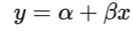
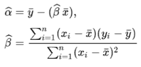
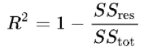
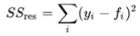
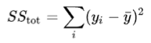

## CSCI 114 Lab 6 Simple Linear Regression
In this lab we will get practice performing a data analysis with simple linear regression. See the course lecture notes for more details.

### The dataset
The dataset for this lab is a simple CSV file with two columns: SAT and GPA. The goal of the lab is to find out how well a students GPA will predict their SAT score. In data science terms we are fitting a linear model to see if there is a strong correlation between a student's GPA and their performance on the SAT.

The data is located in `gpa_sat.csv` and contains 100 rows

### Simple Linear Regression Model
The model we are trying to fit is:

We have a set of (x,y) data points where the x value is the students GPA (column 2 in the CSV file) and the the y value is their SAT score. 

In the lecture notes we reduce the problem to solving the following two equaitons:

Algorithmically we can see that we need to cacluate the mean of the y values, and the mean of the x values. Then we can perform the two summations to find β and then solve for ⍺

#### R-squared

After performing a simple linear regression, we can measure how well the model fits the data with the R-squared value. In our previous lab where we fit our run-time data we got very high R-squared values because the model is essentially exact.

Here we'll need to calculate the R-squared to see how 'good' our model is at predicting the observed data.

R-squared can be found with:

Where

and

The 𝑓i data points are the points output by the model at each x value. So the SSres measures the total amount of error between the actual data points and the predicted data points. SStot measures the variance of the y data points.

### Your Task

Write a program that does a simple linear regression on the `gpa_sat.csv` data.

* Open and read in the CSV data. Since you know that there are only 100 data points you can read the x data (the GPA values) and y values (the SAT score) into two vectors of size 100. Or you can create a DataPoint struct that can hold both values per line.
* Calculate the mean of the x values and the mean of the y values
* Use the x-mean, y-mean and the data points to calulate β (beta)
* Use the x-mean, y-mean and β  to calculate ⍺ (alpha)
* Print out a message with the model the equation predicts: "SAT score = {alpha} + {beta}*GPA" replacing {alpha} and {beta} with the values you calculated.

Now we need to calcuate the R-squared value

*  

