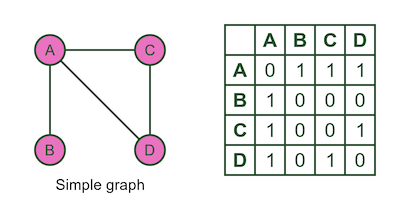

## CSCI 114 Lab 8 BFS

In this lab we will get practice loading in a graph represented by an adjacency matrix and practice implementing the BFS algorithm on a graph.

### Graphs with an adjacency matrix

Graphs are abstract data structures that can represent data items (vertexs or vertexes) and relationships between the data items (edges). We often draw graphs like below:


Here the vertexes are represented with a name (A, B, C...). To store the edges there are many options, however one of the most straight forward methods is to store the exisitance of an edge between two vertexs as a `1` in an 2D _adjacency matrix_:


### BFS

BFS search is a fundamental search algorithm that is performed on graphs. The goal of BFS is to traverse the graph at a starting vertex, enumerating the shortest path to each other vertex.

The algorithm works by taking one step at a time away from the starting vertex, identifying and enqueueing any neighbor vertexs before taking the next vertex off the front of the queue. See the course notes for details.

One valid BFS search order for the given graph, starting at vertex A is:

```
a, c, e, b, d, f, h, g
```

Starting from vertex `f` we get:

```
f, d, e, g, c, a, h, b
```

### Your Program

We will write a program that will:

1. Read in a graph in adjacency matrix form
1. Perform BFS on the graph, printing out the results

#### Task 1 Reading in the graph

Write a C++ program that can read in a graph in adjacency matrix form. The input will be in a data file specified as the first command line argument. The input files will look like the following (representing the graph above):

```
a 0 0 c 0 e 0 0 0
b 0 0 c 0 0 0 0 h
c a b 0 d e 0 g 0
d 0 0 c 0 0 f 0 0
e a 0 c 0 0 f 0 0
f 0 0 0 d e 0 g 0
g 0 0 c 0 0 f 0 h
h 0 b 0 0 0 0 g 0
```

There are N vertexs. The first column is the vertex name. The row then contains `0` (zero) if an edge does not exist between or it contains the vertex name if an edge does exist. You should store the graph in a `std::map<char, set<char> >` where the key is the vertex name and the set contains the vertex names of the vertex's neighbors. 

Once you have read in the graph tell the user "Processed file {file}. Found {N} vertexs: {...}" where {file} is the name of the file and {N} is the number of vertexs and {...} is the vertex names. For example the above graph will print:

```
Processed file graph1.txt. Found 8 vertex: a, b, c, d, e, f, g, h
```

#### Task 2 BFS on the graph

Go into a while loop where you ask the user on which vertex they want to start BFS.

Using that starting vertex, perform a BFS search. Your implementation should remember the order in which the vertexs are discovered and the depth at which they were discovered as you will need to print that out. You will need some way to keep track of the `visited` status of a vertex in order to break cycles. For this lab we will not keep track of predecessors.

The pseudo-code of BFS is:

```
Q = a queue
s = starting vertex

Q.push(s)

while !Q.empty():
    v = Q.pop()
    foreach neighbor n of v:
        if !visited(n):
            Q.push(n)
```
After performing BFS starting at the selected vertex print out the search result (using the example above if the user selected `a`):

```
BFS starting at a: a:0, c:1, e:1, b:2, d:2, f:2, h:3, g:3
```

Or if the user selected `f`:

```
BFS starting at f: f:0, d:1, e:1, g:1, c:2, a:2, h:2, b:3
```
The numbers after the `:` represet the depth away from the starting vertex.

To test your code try writing the following graph into a file and running BFS to see if it matches your expectations:

